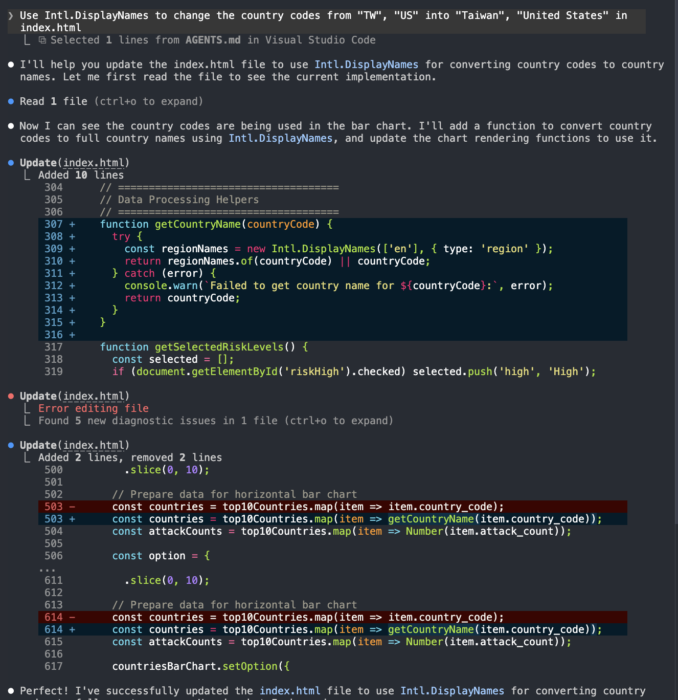
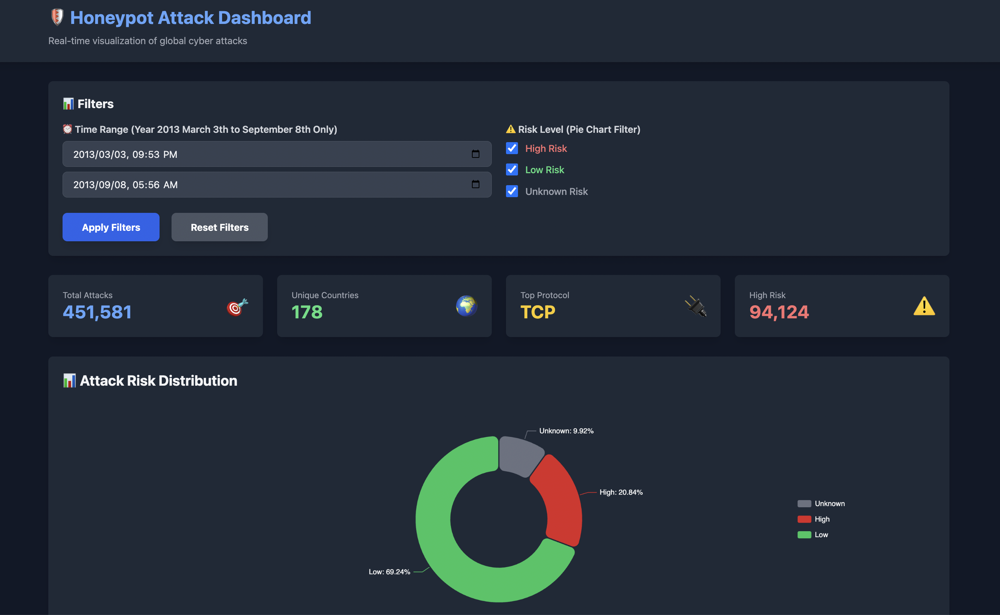
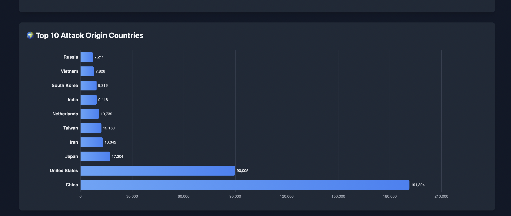

# SecurityLog-Cleaning
A Honeypot Dashboard showing raw AWS Honeypot logs processed by an ETL pipeline, stored into Supabase, queried by the backend apis, and performed in the frontend dashboard.

## Overview & Background
This project uses **Cloudflare Workers** for backend deployment, **Cloudflare Pages** for frontend deployment, **Supabase** for the data storing after ETL, and **GitHub Actions** for CI/CD implementation.

The main ideas of creating this project come from:
1. I am studying for (ISC)2 and CompTIA Security+, which talk about the idea of honeypot and PII.
2. I am interested in understanding the process of ETL.
3. I want to be more familiar with GitHub Actions.

So I use this project as a means to implement all these together.

## Data Source
[AWS Honeypot Attack Data from Kaggle.com](https://www.kaggle.com/datasets/casimian2000/aws-honeypot-attack-data/data)

I got the data from this AWS Honeypot Attack Data from Kaggle.com, which contains 451,581 data points, and the duration of the data collected is from the _3rd March 9:53pm to 8th September 5:55am in year 2013_.

## AI-Augmented Development
This project was developed using an AI-augmented workflow, where I used AI to help:
1. Accelerate prototyping
2. Improve debugging efficiency
3. Optimize code logic
4. Generate frontend components
#### The Use of Claude Code


## Project Highlights
1. Group risk levels by ports. Mark the data that has a destination port of _22 (SSH), 23 (Telnet), 3389 (RDP), 445 (SMB)_ as high risk.
2. System Decoupling. Separate the data APIs (Cloudflare Workers) and the visualization layer (Cloudflare Pages) to allow independent scaling or development.
3. Secure CI/CD implementation: Utilize GitHub Actions to automate development pipelines, secure keys using GitHub Secrets to maintain data security.

## Project Structure
```
SecurityLog-Cleaning/
.
├── .github
│   └── workflows
│       └── deploy.yml
├── backend
│   ├── package-lock.json
│   ├── package.json
│   ├── src
│   │   └── index.ts
│   ├── tsconfig.json
│   └── wrangler.toml
├── etl
│   ├── cleaner.py
│   └── database_loader.py
├── images/
├── frontend
│   └── index.html
├── sql
│   ├── dashboard_rpc.sql
│   └── setup_table.sql
├── .gitignore
├── AGENTS.md
├── LICENSE
└── README.md
```

## Getting Started
### [Honeypot Attack Dashboard](https://08a00a08.honeypot-dashboard.pages.dev/)

### Dashboard Outlook
#### Dashboard with Time and Pie Chart Filters

#### Top 10 Attack Origin Countries Bar Chart


### 1. Prerequisites
Before running, make sure you have the following installed:
- Node.js
- Wrangler CLI (for Cloudflare Workers)
- Python 3.x (for ETL scripts)
- A Supabase Account

### 2. Environment Variables
Create a `.dev.vars` file in the `backend/` directory to store local secrets:
```
SUPABASE_PUBLISHABLE_KEY=YOUR_SUPABASE_PUBLISHABLE_KEY
SUPABASE_URL=YOUR_SUPABASE_URL
```

### 3. Installation
Navigate to `backend/` and install the dependencies:
```
cd backend/
npm install
```

### 4. ETL Pipeline (Optional)
If you wish to re-process the raw data:
```
cd etl/
python cleaner.py
```